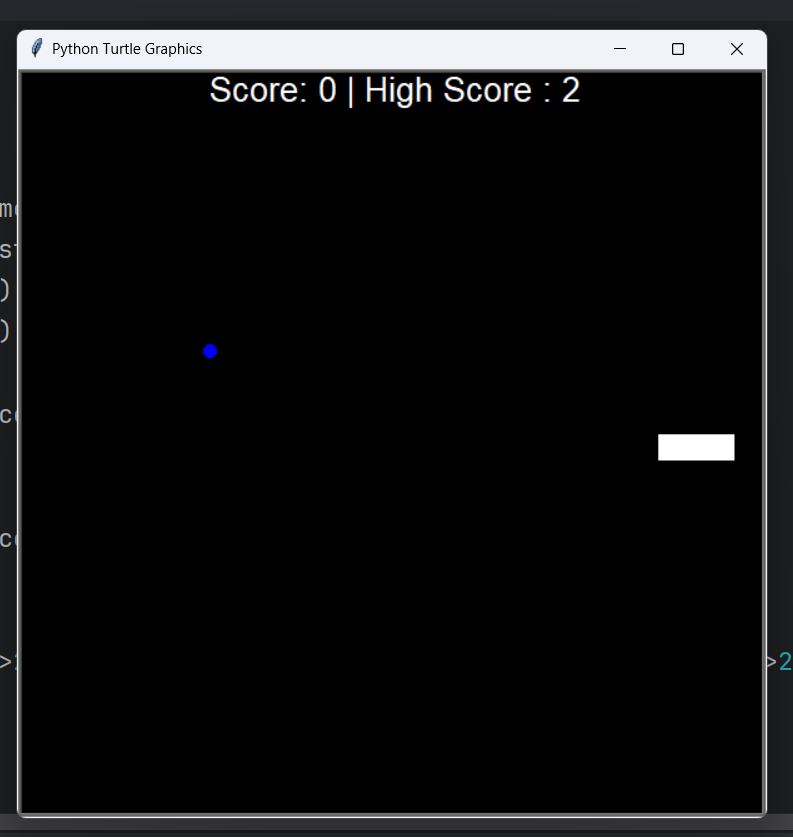

# Snake Game
## Snake Main Function

```
import time

my_screen = Screen()
my_screen.setup(width=600,height=600)
my_screen.bgcolor("black")
my_screen.tracer(0)

snake = Snake()
food = Food()
score = ScoreBoard()

my_screen.listen()
my_screen.onkey(key="Up",fun=snake.up)
my_screen.onkey(snake.down,"Down")
my_screen.onkey(snake.right,"Right")
my_screen.onkey(snake.left,"Left")

game_on = True

while game_on:
    my_screen.update()
    time.sleep(0.1)
    snake.move()
    
    for seg in snake.segment[1:]:
        if snake.head.distance(seg) < 10:
            score.reset()
            snake.reset()
 
    if snake.head.distance(food)<15:
        food.refresh()
        snake.extend()
        score.increase_score()
        
    
    if snake.head.xcor()>280 or snake.head.xcor()<-280 or snake.head.ycor()>280 or snake.head.ycor()<-280:
        score.reset()
        snake.reset()
```

## Snake Body Function
```
from turtle import Turtle

SEG_POSITION = [(0, 0), (-20, 0), (-40, 0)]
MOVE = 20

UP = 90
DOWN = 270
RIGHT = 0
LEFT = 180
class Snake:
    
    def __init__(self):
        self.segment = []
        self.create_snake()
        self.head = self.segment[0]
        
    def create_snake(self):
        for i in SEG_POSITION:
            self.add_segments(i)
    
    def add_segments(self,position):
        new_seg = Turtle("square")
        new_seg.color("white")
        new_seg.penup()
        new_seg.goto(position)
        self.segment.append(new_seg)
    
    def reset(self):
        for seg in self.segment:
            seg.goto(1000,1000)
        self.segment.clear()
        self.create_snake()
        self.head = self.segment[0]
        
    def extend(self):
        self.add_segments(self.segment[-1].position())
            
    def move(self):
        for seg_no in range(len(self.segment) - 1, 0, -1):
            x_axis = self.segment[seg_no - 1].xcor()
            y_axis = self.segment[seg_no - 1].ycor()
            self.segment[seg_no].goto(x_axis, y_axis)
        
        self.head.forward(MOVE)
    
    def up(self):
        if self.head.heading() != DOWN:
            self.head.setheading(UP)
    def down(self):
        if self.head.heading() != UP:
            self.head.setheading(DOWN)
    def right(self):
        if self.head.heading() != LEFT:
            self.head.setheading(RIGHT)
    def left(self):
        if self.head.heading() != RIGHT:
            self.head.setheading(LEFT)
```
## Snake Food Function
```
from turtle import Turtle
import random

class Food(Turtle):
    def __init__(self):
        super().__init__()
        self.shape("circle")
        self.color("blue")
        self.shapesize(stretch_len=0.5,stretch_wid=0.5)
        self.speed("fastest")
        self.penup()
        self.refresh()
    
    def refresh(self):
        x_value = random.randint(-260, 260)
        y_value = random.randint(-260, 260)
        self.goto(x_value,y_value)
```
## Snake Score Function
```
from turtle import Turtle

class ScoreBoard(Turtle):
    def __init__(self):
        super().__init__()
        with open("High_score_file.txt") as file:
            self.high_score = int(file.read())
        self.score = 0
        self.color("white")
        self.penup()
        self.goto(0, 270)
        self.score_board()
        self.hideturtle()
    
    def score_board(self):
            self.clear()
            self.write(f"Score: {self.score} | High Score : {self.high_score}",align="center",font=('Arial', 20, 'normal'))
        
    def reset(self):
        if self.score > self.high_score:
            self.high_score = self.score
            with open("High_score_file.txt", "w") as file:
                file.write(f"{self.high_score}")
        self.score = 0
        self.score_board()
        
    def increase_score(self):
        self.score+=1
        self.score_board()
```
## Output

